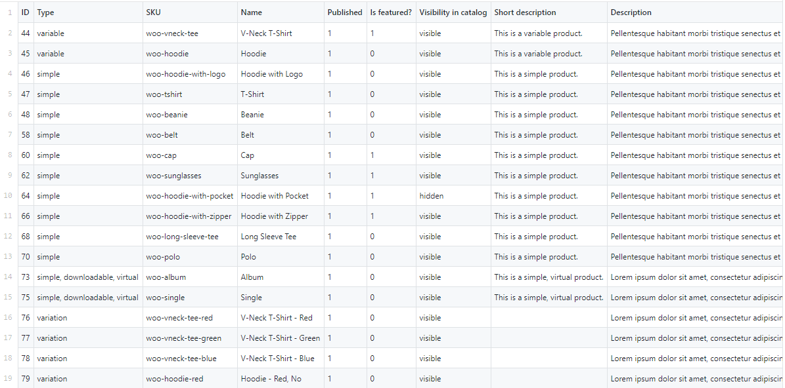
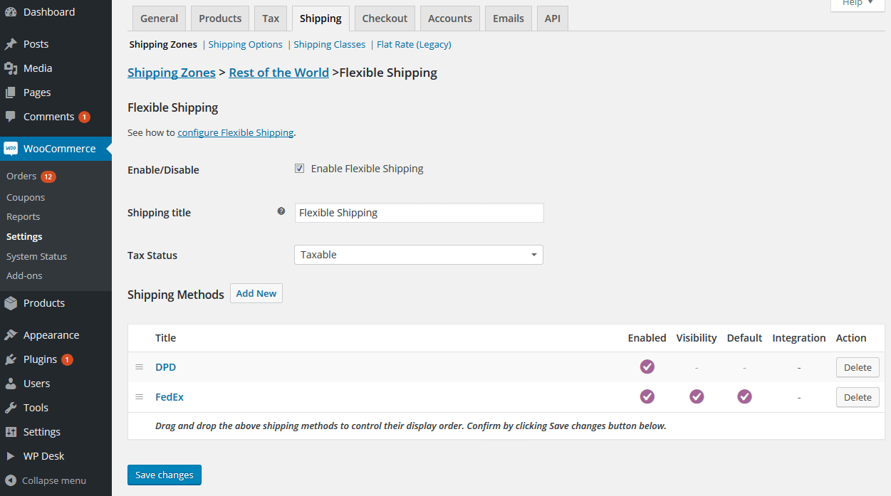
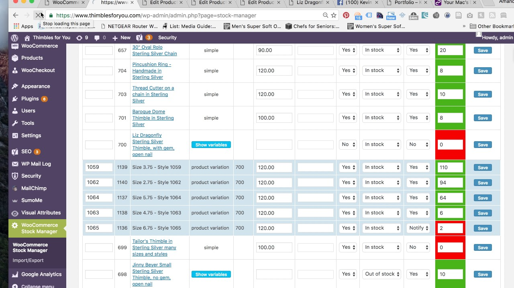
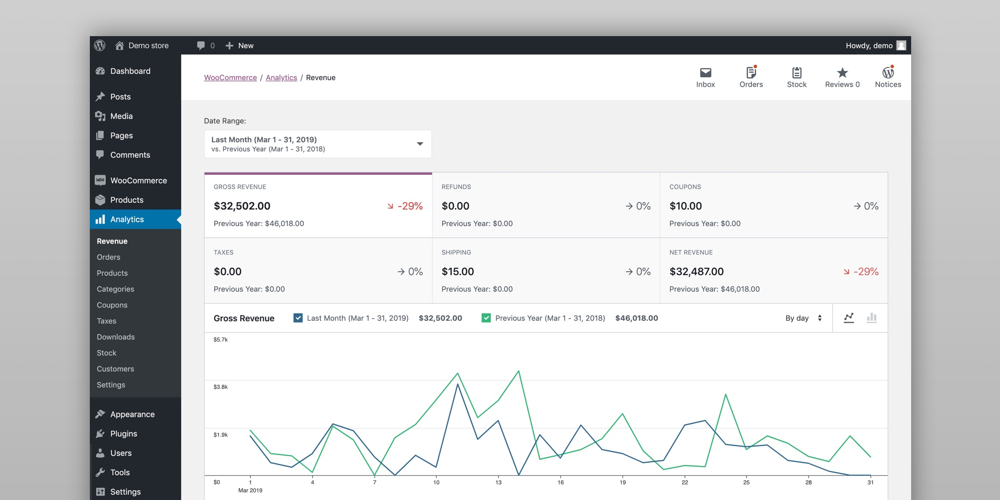

# Why woocommerce
## Robust
- Built on Wordpress which powers 34% of the web
- Compatible with other Wordpress plugins

## Adaptive
- Sell physical, digital products, services, content, appointments, anything!

## Scalable
- Opensource, meaning unlimited products and users

# Developper-oriented
- Open development
- 400 official extensions
- AJAX, endpoints, webhooks
- REST API
- Well-documented

# Sell beautifully
- Variety of themes
- Customizable parts
- Categorized, tagged, attributed products
- Product ratings and reviews
- Sorting and filtering

# Sell anywhere
- Physical products to be shipped or digital downloadable products
- Affiliate products
- Product variation : color, size, fabric
- Import, export, update product using CSV

- Stripe and paypal payments
- Shipping options : pickup, local delivery, shipping
- Shipping rates : flat rate, specific rate...
- Geo-location integrated
- Tax rates options
- Product vendors extension : allow multi-vendors and set commission rate

# Store management
- Customer account management & guest checkout
- One-click refund
- Inventory management
- Full order management : notes, edit stock, mark shipped items...
- Email templates for different stages
- Add shop managers with certain rights (non-admin)

# Optimize
- SEO
- Coupons
- Related product recommendation
- Widget recently purchased, popular this month...
- Reporting : sales, refunds, top products...
- Dashboard : see how store is doing

